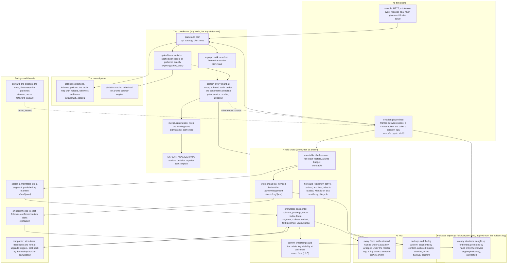
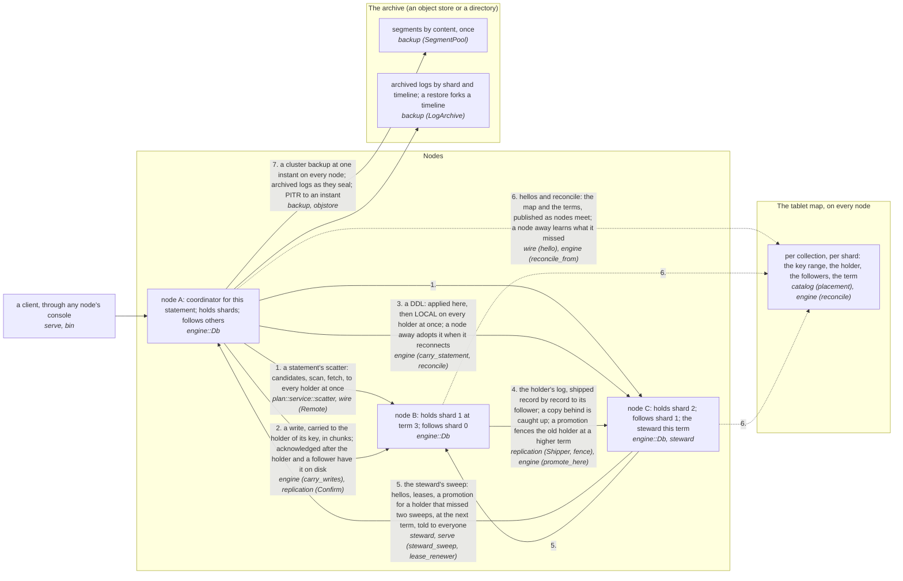

# The architecture, in two diagrams

What a node is made of, and what a cluster of them does together. Every
box names the module that implements it (`src/<module>.rs`, or
`src/<module>/`), so the diagram is an index into the code, not a
picture beside it. The prose that explains each decision is in
[design.md](design.md); the SQL each part answers to is in
[sql.md](sql.md). Both diagrams render on GitHub as Mermaid.

## One node

Not on it, on purpose: the SQL grammar's shape (`docs/sql.md` is that),
the segment's byte layout and the vector index's tiers (`segment` and
`vector` document their own formats), the statement deadline's threading
through every loop (`deadline` is consulted, not drawn), the simulator's
fault schedule on the shard boundary (`sim` stands where the scatter
meets a held shard and injects drops, restarts and reorder), the
console's metrics and logs (`serve`, `log`), and the command line
(`bin`), which is a client of the console like any other.

## A cluster

Not on it, on purpose: a shard's move between nodes (`engine` "moves":
the source pins the shard, the target pulls its files, the map
switches and every node agrees), a split and a merge (the holder does
both and the map learns the new range), regions and the placement of
followers across them (`engine` `region_of`, the steward's preference
for a same-region copy under `confirm = all`), the `minimal` tier's
decision of which replica holds an index (`residency::Placement`),
and the rebalance. Each of those is a paragraph in
[design.md](design.md), under the heading that names it.
